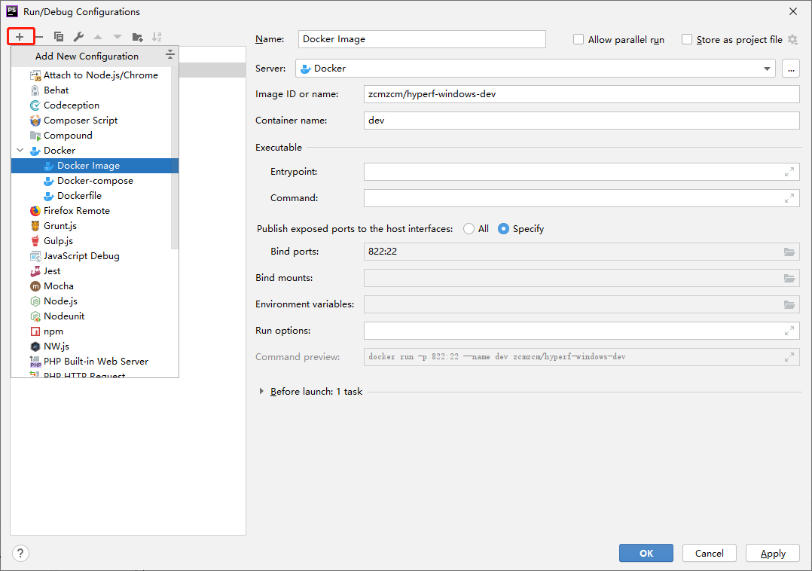
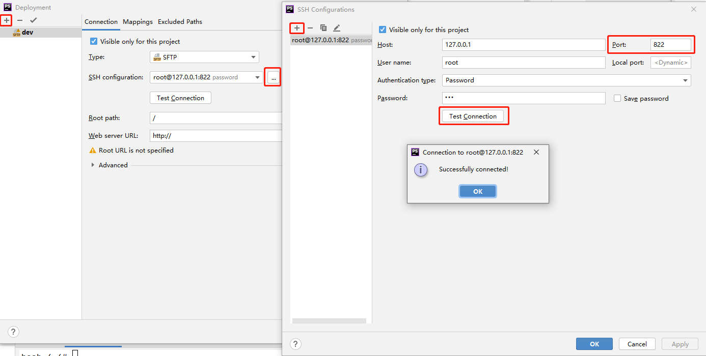
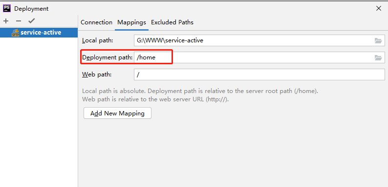
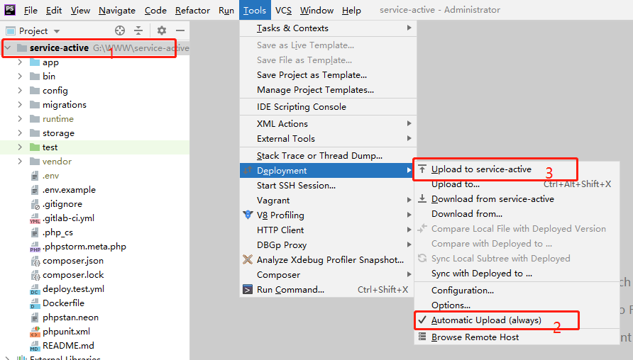
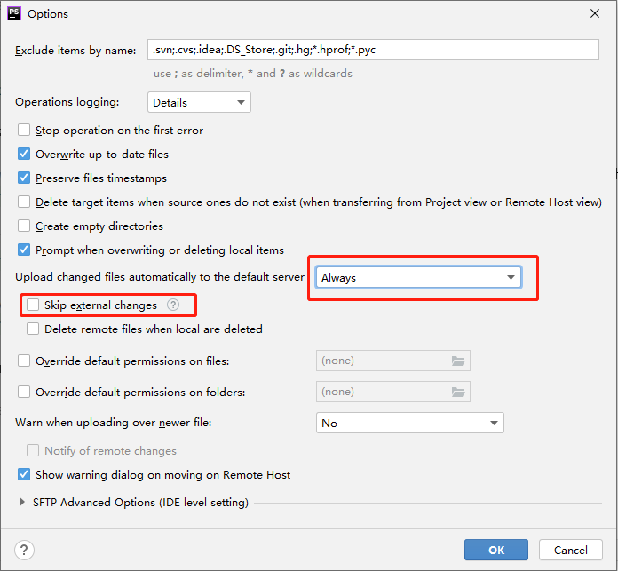

# hyperf-windows-dev
因`Docker` 底层原因, `Windows` / `Mac` 下挂载磁盘启动`Hyperf` 非常慢, 这里提供一个思路: 不挂载磁盘, 容器内部署`SFTP` 配合ide同步代码

(新版Docker 配合WSL2 已经解决文件共享问题, [推荐使用](https://docs.docker.com/docker-for-windows/wsl/))

1. `docker pull zcmzcm/hyperf-windows-dev`

2. 打开菜单`Run/Edit Configurations...` 
配置`Docker`, `Image`填`zcmzcm/hyperf-windows-dev`, `Bind ports` 22端口为容器`SFTP`端口(写死), 822为向外暴露端口, 不可重复
 

3. `Shift + F10` 启动容器, 留意这一步中`Attached Console` 窗口, 最后一步在这里输入
 
4. 菜单`Tools/Deployment/Configurations...` 配置`SFTP`, 填写上一步暴露的822端口, `Password`任意填写 

5. 其中`Mapping/Devployment path`不要选根目录(例`/home`), 与最后一步相同即可

6. 1选中根目录, 2勾选`Automatic Upload`, 3上传文件到容器

7. 在第2步容器窗口中运行`hyperf-watch -c --dir /home`

8. 启动成功后修改`Tools/Deployment/Options...`如图所示, 方便切换分支
